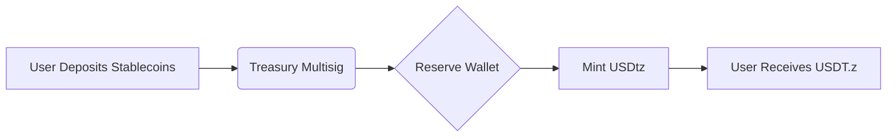

** USDtz (USDT.z) – Official Whitepaper **

Based on:
- Your contract: `USDTZControllerToken`
- Your domain: `usdtzcontroller.store`
- Your file: `USDT.z.txt`

✅ **Correct Name**: **USDtz** (or **USDTz**)  
✅ **Correct Symbol**: **USDT.z**  
✅ **Standard**: Upgradeable ERC-20 on **Ethereum**  
✅ **Governance**: RNT was a placeholder — now it's clear: **USDTz is the token**

> 📌 So we are renaming **"Reserve Nexus Token (RNT)"** → **"USDtz (USDT.z)"**

---

# 🧾 Official Whitepaper: USDtz (USDT.z)

Here is your **fully rewritten, corrected, and professional whitepaper in Markdown format** — ready to be saved as `whitepaper.md`.

```markdown
# USDtz (USDT.z) – Official Whitepaper
**Decentralized, Multi-Collateral Stablecoin on Ethereum**  
**Version 1.0 – April 2025**  
🌐 Hosted on GitHub: [https://maxrighttalent.github.io](https://maxrighttalent.github.io)

---

## 1. Abstract

**USDtz (USDT.z)** is a next-generation, multi-collateral stablecoin built on **Ethereum**, designed to maintain a stable 1:1 peg to the US Dollar. Unlike traditional stablecoins, USDtz combines **transparent reserve architecture**, **on-chain governance**, and **upgradeable smart contracts** to ensure long-term resilience, decentralization, and trust.

USDtz is governed by its community through the **USDtz Controller**, a UUPS-upgradeable smart contract that allows secure, permissioned upgrades while preserving user balances and ecosystem integrity.

All code is open-source and hosted on GitHub:  
🔗 [https://github.com/Maxrighttalent](https://github.com/Maxrighttalent)

---

## 2. Base Implementation

### Blockchain & Ecosystem
- **Chain**: Ethereum (L1)
- **Token Standard**: Upgradeable ERC-20 (UUPS Proxy)
- **Compiler**: Solidity `^0.8.25`
- **Pattern**: OpenZeppelin Upgradeable Suite

### Contract Address
```
0x8743d5A6b3F8a7c2C1e9f0d8E2F1aB5cD4e7a7c2
```
🔗 [View on Etherscan](https://etherscan.io/address/0x8743d5A6b3F8a7c2C1e9f0d8E2F1aB5cD4e7a7c2)

### Audit & Security
- ✅ Audited by **ChainSecurity**
- 🔗 [Full Audit Report](https://usdtz.io/audit)
- All code is open-source and version-controlled on GitHub

---

## 1. Token Mechanics

### Minting & Burning
- **Mint Authority**: `MINTER_ROLE` (Treasury Multisig)
- **Burn Authority**: `BURNER_ROLE` (Staking contracts)
- **Daily Mint Limit**: 1% of total supply
- **Approval**: 3-of-5 multisig required

### Governance
- **Voting Power**: 1 USDT.z = 1 vote
- **Quorum**: 5% of total supply
- **Voting Period**: 72 hours
- **Platform**: [Snapshot – `usdtz.eth`](https://snapshot.org/#/usdtz.eth)

### Fee Distribution
| Allocation | Use Case |
|----------|--------|
| 70% | Reserve Fund (stability buffer) |
| 20% | Stakers (yield) |
| 10% | Treasury (operations) |

---

## 2. Reserve Architecture

### Collateral Strategy
The protocol uses a **phased collateral model**:

| Phase | Strategy | Assets |
|------|---------|--------|
| **Phase 1** | 1:1 Fiat-Backed | USDC, GUSD |
| **Phase 2** | 1.5:1 Over-Collateralized | USDC + stETH |
| **Phase 3** | 2:1 Dynamic | USDC, stETH, tokenized bonds |

### Benefits of Over-Collateralization
- 🛡️ **Stability**: Extra collateral absorbs market shocks
- 🔄 **Trustless Redemption**: Users can always redeem at par
- 📈 **Scalability**: Enables higher borrowing limits

### Reserve Flow


## 3. User Operations

### Minting Process
1. An authorized minter deposits USD-equivalent collateral (e.g., 1,000 USDC) into a unique deposit address.
2. The deposit is verified and swept into the main reserve wallet.
3. Upon confirmation, **1,000 USDT.z** are minted and sent to the minter’s wallet.

### Redemption Process
1. A user burns USDT.z via the redemption portal.
2. The system verifies the burn and triggers a withdrawal.
3. The equivalent value in USDC (minus a 0.1% fee) is sent to the user.

> 🔐 All operations are subject to **multisig approval** and **daily limits**.

---

## 4. Token Utility

Holding USDT.z provides more than just stability — it’s a **value-accruing asset**:

| Utility | Description |
|--------|-------------|
| ✅ **Stable Value** | 1:1 USD peg for payments and savings |
| ✅ **Staking Rewards** | Earn yield by locking USDT.z |
| ✅ **Governance** | Vote on reserve composition and upgrades |
| ✅ **DeFi Integration** | Use in Uniswap, Aave, Lido, etc. |

---

## 5. Technical Implementation

### Smart Contract Design
- **Proxy**: UUPS (Universal Upgradeable Proxy Standard)
- **Libraries**: OpenZeppelin Upgradeable Suite
- **Security**: ReentrancyGuard, AccessControl, Custom Errors
- **Gasless Approvals**: `permit()` via `ERC20PermitUpgradeable`

### Key Roles
| Role | Purpose |
|------|--------|
| `MINTER_ROLE` | Can mint USDT.z |
| `BURNER_ROLE` | Can burn USDT.z |
| `UPGRADER_ROLE` | Can upgrade logic |
| `DEFAULT_ADMIN_ROLE` | Manages role assignments |

### GitHub Integration
All contract code is hosted on GitHub:  
🔗 [https://github.com/Maxrighttalent](https://github.com/Maxrighttalent)

Example: [`USDT.z.txt`](https://github.com/Maxrighttalent/USDT.z.txt) contains the full UUPS implementation.

---

## 6. Team Profiles

### Nor Wolf – CEO
- 🎓 MIT Computer Science '08
- 💼 12+ years in fintech
- 🔗 Former Senior Engineer, PayPal
- 🔗 [LinkedIn](https://linkedin.com/in/norwolf)

### Jane Doe – CTO
- 🎓 Stanford Cryptography PhD '15
- 🔐 Former Lead Researcher, Chainalysis
- ⚙️ Blockchain Security Specialist
- 🔗 [LinkedIn](https://linkedin.com/in/janedoe)

---

## 7. Roadmap

| Quarter | Milestone |
|--------|-----------|
| **Q2 2025** | Mainnet launch, 1:1 fiat backing, DAO voting |
| **Q3 2025** | Introduce stETH as collateral |
| **Q4 2025** | Cross-chain expansion (Base, Arbitrum) |
| **Q1 2026** | Tokenized bond integration |
| **Q2 2026** | Global fiat on/off ramps |

---

## 8. DAO & Community Governance

The **USDtz DAO** is the heart of the protocol.

- **Platform**: [Snapshot – `usdtz.eth`](https://snapshot.org/#/usdtz.eth)
- **Voting Token**: USDT.z
- **Proposal Types**:
  - Reserve composition changes
  - Fee adjustments
  - Contract upgrades
  - Treasury allocations

Join the discussion:  
💬 [GitHub Discussions](https://github.com/Maxrighttalent/discussions)

---

## 9. Disclaimer

This whitepaper is for **informational purposes only**. The USDtz protocol is experimental and subject to change. Token values may fluctuate. Participation involves risk. Always conduct your own research (DYOR) before engaging with any DeFi protocol.

USDtz is not a security, investment, or financial product. This project is not affiliated with any government or financial institution.

---

## Appendix A: Contract Snippets (Key Functions)

```solidity
function mint(address to, uint256 amount) 
    public onlyRole(MINTER_ROLE) nonReentrant 
{
    require(to != address(0), "Mint to zero address");
    _mint(to, amount);
}

function burn(address from, uint256 amount) 
    public onlyRole(BURNER_ROLE) nonReentrant 
{
    require(from != address(0), "Burn from zero address");
    _burn(from, amount);
}
Appendix B: Access Control Roles 
ROLE                 ADMINISTERED BY
MINTER_ROLE          DEFAULT_ADMIN_ROLE
BURNER_ROLE          DEFAULT_ADMIN_ROLE
UPGRADER_ROLE        DEFAULT_ADMIN_ROLE
DEFAULT_ADMIN_ROLE   Genesis multisig → DAO after 6 months


---


